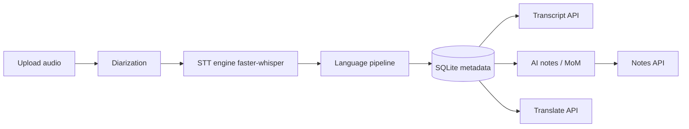

# Technical Specification
## Multilingual Meeting Transcription Platform

## 1. System Overview

The platform is a web application that ingests an audio recording of a meeting and
produces:

1. A **verbatim multilingual transcript** (with language & speaker metadata),
2. Optional **AI summary / notes / Minutes-of-Meeting** in a selectable language,
3. Optional **translation** as a separate, explicit operation.



## 2. Technology Stack

| Layer | Choice |
|-------|--------|
| Backend | Python 3.10+, FastAPI, uvicorn |
| STT | faster-whisper ≥ 1.0 (Whisper `large-v3` default; `base`/`small` for CI) |
| Language detection | Whisper per-segment LID token (`language`, `language_probability`) |
| Script detection | Unicode block analysis (in-house, no extra deps) |
| Diarization | pyannote.audio (optional) → single-speaker fallback |
| AI (notes/summary/MoM/translation) | OpenAI-compatible chat API (DeepSeek / OpenAI / custom) |
| Database | SQLite via SQLAlchemy 2.0 |
| Validation | pydantic v2 |
| Frontend | Static HTML + vanilla JS + CSS served by FastAPI |
| Tests | pytest, httpx TestClient |
| Metrics | jiwer (WER/CER), pyannote.metrics (DER, optional) |
| Fixture audio | edge-tts (synthetic) + user-provided real recordings |

## 3. Directory Layout

```
backend/
├── app/
│   ├── main.py
│   ├── config.py
│   ├── db.py
│   ├── models.py
│   ├── schemas.py
│   ├── stt/{engine,language,vocab}.py
│   ├── diarization/engine.py
│   ├── ai/{providers,notes,translate}.py
│   ├── services/transcription.py
│   └── routes/{meetings,transcript,notes,translate,vocabulary,languages,settings,evaluate}.py
├── tests/{unit,integration,acceptance,fixtures}/
├── benchmarks/run_benchmarks.py
└── frontend/{index.html,app.js,styles.css}
```

## 4. Core Components

### 4.1 STT Engine (`app/stt/engine.py`)

- `TranscriptionEngine` abstract interface with a single method:
  `transcribe(audio_path, language_mode, hotwords, initial_prompt) -> list[Segment]`.
- `FasterWhisperEngine` implementation wraps `faster_whisper.WhisperModel`.
- `MockTranscriptionEngine` provided for tests.
- Each `Segment` carries: `start`, `end`, `text`, `language`,
  `language_probability`, `avg_logprob`, `no_speech_prob`.

**Language mode** (`auto` | `manual:<code>` | `code-switching`):
- `auto` → rely on Whisper LID per window.
- `manual` → force `language` code.
- `code-switching` → allow per-segment language variation (Whisper's default behavior),
  and enable switch detection downstream.

### 4.2 Language Pipeline (`app/stt/language.py`)

Functions (pure, easily unit-testable):

| Function | Purpose |
|----------|---------|
| `detect_script(text)` | Returns script name(s): Devanagari, Bengali, Gujarati, Gurmukhi, Tamil, Telugu, Kannada, Malayalam, Odia, Arabic, Latin, Mixed |
| `detect_segment_language(segment)` | From STT LID token |
| `detect_meeting_language(segments)` | Aggregated, sorted, comma-joined codes e.g. `"hi,en"` |
| `detect_speaker_language(segments)` | Dominant code per speaker |
| `detect_language_switches(segments)` | List of switch events (prev → next code) |
| `language_label(code)` | Human label; `"hi,en"` → `"Hinglish"` |
| `is_low_confidence(segment, cfg)` | threshold check on `language_probability`, `avg_logprob`, `no_speech_prob` |

**Romanized-language rule (RQ-56):** `language` is taken from the acoustic LID token;
`script` is computed from text. A Latin-script segment may therefore be labeled
`Hindi`/`Hinglish` — script and language are independent metadata.

**Confidence thresholds (configurable, defaults):**

| Signal | Default low threshold |
|--------|----------------------|
| `language_probability` | < 0.60 |
| `avg_logprob` | < −1.0 |
| `no_speech_prob` | > 0.60 |

Any trigger marks the segment `low_confidence=True` and the UI shows
*"Low transcription confidence for this segment."*

### 4.3 Vocabulary & Names (`app/stt/vocab.py`)

- Vocabulary entries: `term`, `language` (nullable = all), `script`, `category`
  (`technical` | `project` | `person`).
- `build_initial_prompt(entries, language)` → context paragraph naming terms.
- `build_hotwords(entries, language)` → list of hot-words for faster-whisper.
- `apply_vocab(text, entries)` → case-insensitive substitution on Latin terms, exact
  match on native script. Never translates; only corrects recognized tokens.

### 4.4 Diarization (`app/diarization/engine.py`)

- `DiarizationEngine` interface → `assign(audio_path, segments) -> speaker_labels`.
- `PyannoteDiarizer` — maps speaker turns to segments by temporal overlap (requires
  HF token + torch; optional).
- `SingleSpeakerDiarizer` — assigns `"SPEAKER_00"` to every segment (fallback).

### 4.5 AI Providers (`app/ai/providers.py`)

- `LLMProvider` = `name`, `base_url`, `api_key`, `model`.
- Presets: **DeepSeek** (`https://api.deepseek.com`, `deepseek-chat`), **OpenAI**
  (`https://api.openai.com/v1`, `gpt-4o-mini`), **Custom** (user-entered).
- `LLMClient.complete(system, user, temperature) -> str` uses the `openai` SDK with a
  configurable `base_url`.
- Providers are stored in `Settings` so users can add any OpenAI-compatible endpoint.

### 4.6 AI Notes / MoM (`app/ai/notes.py`)

- `generate_summary`, `generate_notes`, `generate_mom`.
- Input: language-tagged transcript text (`[00:01:04] Speaker 1 [Hindi] …`).
- Target output language: `same` | `en` | `hi` | any code.
- Prompt instructs the model to: understand all languages, never ignore non-English
  sections, never alter the transcript, never translate names.

### 4.7 Translation (`app/ai/translate.py`)

- `translate_text(text, source, target, provider)` — explicit, separate operation.
- Used only when the user requests "Translate transcript".

## 5. Data Model

| Table | Columns |
|-------|---------|
| `meetings` | id, title, created_at, status, meeting_language, duration |
| `segments` | id, meeting_id, speaker_id, start, end, text, language, language_confidence, script, avg_logprob, no_speech_prob, low_confidence |
| `speakers` | id, meeting_id, label, dominant_language |
| `vocabulary` | id, term, language, script, category |
| `notes` | id, meeting_id, kind (`summary`/`notes`/`mom`/`translation`), language, content, created_at |
| `settings` | id, key, value (JSON) |

`meeting_language` / `segment_language` / `speaker_language` / `language_confidence`
are stored per RQ-65.

## 6. API Surface

| Method | Path | Purpose |
|--------|------|---------|
| GET | `/languages` | Supported languages + labels |
| POST | `/meetings` | Create meeting |
| POST | `/meetings/{id}/upload` | Upload audio file |
| POST | `/meetings/{id}/transcribe` | Run full pipeline (language mode, vocab) |
| GET | `/meetings/{id}/transcript` | Language-tagged transcript + switch events + warnings |
| POST | `/meetings/{id}/notes` | Generate summary/notes/mom (target language) |
| GET | `/meetings/{id}/notes` | List generated notes |
| POST | `/meetings/{id}/translate` | Optional transcript translation |
| GET/POST/DELETE | `/vocabulary` | Manage custom vocabulary & names |
| GET/PUT | `/settings` | Language defaults, provider config, thresholds |
| POST | `/evaluate` | Run a benchmark on a reference/hypothesis pair |

Full reference: [`API.md`](API.md).

## 7. Configuration (environment variables)

| Key | Default |
|-----|---------|
| `STT_MODEL` | `large-v3` |
| `STT_DEVICE` | `cpu` |
| `STT_COMPUTE_TYPE` | `int8` |
| `DATABASE_URL` | `sqlite:///./meeting_notes.db` |
| `LANG_PROB_THRESHOLD` | `0.60` |
| `AVG_LOGPROB_THRESHOLD` | `-1.0` |
| `NO_SPEECH_THRESHOLD` | `0.60` |
| `LLM_DEFAULT_PROVIDER` | `deepseek` |

## 8. Testing & Benchmarking

See [`TEST_PLAN.md`](TEST_PLAN.md) and [`BENCHMARKS.md`](BENCHMARKS.md).
